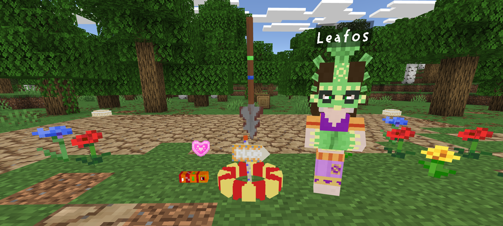

<h3> 0.0 - Breaking Ground </h3>

Leafos needs your help! The soil of this neglected garden has hardened to a point where even weeds might have trouble growing. Grab a shovel and get to whacking. You might just attract the attention of a sweet visitor or two.

This initial release includes many features with the aim of building a solid base from which to start. These include:

* Gardens
    * Interacting with a garden allows you to tweak its settings, location, change its name, ban pinata, and design your label!
* Leafos
    * She's here to point you in the right direction - and spread gossip
* Whirlms
    * Once you get started you are sure to attract a Whirlm. As a resident you can direct them, romance them, and even stage fights with a tap of your shovel! If you hit a bit harder you might just get a sweet surprise as well.
* The Shovel
    * It may be rusty, but it is irreplaceable for beginning your gardening career. Left click to whack and right click to tap.
* The Journal
    * A wealth of information - even if there is currently not much to be had. Right clicking a pinata will help you with their requirements.
* And more!
    * Exploring the creative menu may yield interesting results.

The latest release can be found <a href="./Bedrock%20Paradise.mcaddon">here</a>

